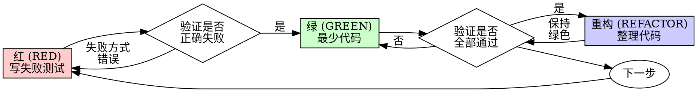

# 测试驱动开发 (Test-Driven Development, TDD)

## 概述

先写测试。看它失败。写最少代码使其通过。

**核心原则：** 如果你没有看到测试失败，你就不知道它是否在测试正确的东西。

**违反规则的字面意思，就是违反了规则的精神。**

## 使用时机

**始终使用：**
- 新功能
- Bug 修复
- 重构
- 行为变更

**例外（询问你的真人伙伴）：**
- 一次性原型
- 生成的代码
- 配置文件

想着"就这一次跳过 TDD"？停下来。那是在自我欺骗。

## 铁律

```
没有先写失败测试，就不得写生产代码
```

在测试之前写了代码？删掉它。重新开始。

**没有例外：**
- 不要把它保留作"参考"
- 不要在写测试时"适配"它
- 不要看它
- 删除就是删除

从测试重新实现。句号。

## 红-绿-重构循环



### 红（RED）- 写失败测试

写一个展示应该发生什么的最小测试。

<Good>
```typescript
test('重试失败操作 3 次', async () => {
  let attempts = 0;
  const operation = () => {
    attempts++;
    if (attempts < 3) throw new Error('fail');
    return 'success';
  };

  const result = await retryOperation(operation);

  expect(result).toBe('success');
  expect(attempts).toBe(3);
});
```
名称清晰，测试真实行为，只测一件事
</Good>

<Bad>
```typescript
test('retry works', async () => {
  const mock = jest.fn()
    .mockRejectedValueOnce(new Error())
    .mockRejectedValueOnce(new Error())
    .mockResolvedValueOnce('success');
  await retryOperation(mock);
  expect(mock).toHaveBeenCalledTimes(3);
});
```
名称模糊，测试的是模拟 (mock) 而非代码
</Bad>

**要求：**
- 一个行为
- 名称清晰
- 真实代码（除非不可避免，否则不要使用模拟 (mock)）

### 验证红（RED）- 看它失败

**强制要求。永远不要跳过。**

```bash
npm test path/to/test.test.ts
```

确认：
- 测试失败（不是报错）
- 失败信息符合预期
- 因功能缺失而失败（而非拼写错误）

**测试通过了？** 你在测试已有行为。修复测试。

**测试报错了？** 修复报错，重新运行，直到它正确失败。

### 绿（GREEN）- 最少代码

写让测试通过的最简单代码。

<Good>
```typescript
async function retryOperation<T>(fn: () => Promise<T>): Promise<T> {
  for (let i = 0; i < 3; i++) {
    try {
      return await fn();
    } catch (e) {
      if (i === 2) throw e;
    }
  }
  throw new Error('unreachable');
}
```
刚好足够通过
</Good>

<Bad>
```typescript
async function retryOperation<T>(
  fn: () => Promise<T>,
  options?: {
    maxRetries?: number;
    backoff?: 'linear' | 'exponential';
    onRetry?: (attempt: number) => void;
  }
): Promise<T> {
  // YAGNI（你不会需要它）
}
```
过度设计
</Bad>

不要添加功能、重构其他代码，或在测试之外"改善"。

### 验证绿（GREEN）- 看它通过

**强制要求。**

```bash
npm test path/to/test.test.ts
```

确认：
- 测试通过
- 其他测试仍然通过
- 输出干净（无错误、无警告）

**测试失败了？** 修复代码，而非测试。

**其他测试失败了？** 立即修复。

### 重构（REFACTOR）- 整理代码

只在绿色之后：
- 消除重复
- 改善名称
- 提取辅助函数

保持测试绿色。不要添加行为。

### 重复

为下一个功能写下一个失败测试。

## 好的测试

| 质量 | 好的 | 差的 |
|---------|------|-----|
| **最小化** | 一件事。名字里有"and"？拆分它。 | `test('validates email and domain and whitespace')` |
| **清晰** | 名字描述行为 | `test('test1')` |
| **展示意图** | 演示期望的 API | 掩盖代码应该做什么 |

## 为什么顺序很重要

**"我会在之后写测试来验证它能用"**

代码写完后的测试会立即通过。立即通过什么都证明不了：
- 可能在测试错误的东西
- 可能在测试实现，而非行为
- 可能遗漏了你忘记的边缘情况
- 你从未看到它捕获 bug

先写测试迫使你看到测试失败，证明它确实在测试某些东西。

**"我已经手动测试了所有边缘情况"**

手动测试是临时性的。你以为测了所有内容，但是：
- 没有测试内容的记录
- 代码改变时无法重新运行
- 在压力下容易忘记情况
- "我试过它有效"≠ 全面测试

自动化测试是系统性的。它们每次以相同方式运行。

**"删除 X 小时的工作是浪费"**

沉没成本谬误。时间已经过去了。你现在的选择：
- 删掉并用 TDD 重写（再花 X 小时，高信心）
- 保留它并事后添加测试（30 分钟，低信心，可能有 bug）

"浪费"是保留你不能信任的代码。没有真实测试的有效代码是技术债务。

**"TDD 是教条主义的，务实意味着适应"**

TDD 就是务实的：
- 在提交之前找到 bug（比事后调试快）
- 防止回归（测试立即捕获破坏）
- 记录行为（测试展示如何使用代码）
- 支持重构（自由修改，测试捕获破坏）

"务实的"快捷方式 = 在生产中调试 = 更慢。

**"事后写测试实现相同目标——是精神而非仪式"**

不。事后写测试回答"这做了什么？"先写测试回答"这应该做什么？"

事后测试受你实现的偏见影响。你测试你构建的内容，而非需要的内容。你验证记住的边缘情况，而非发现的情况。

先写测试迫使你在实现之前发现边缘情况。事后写测试验证你记得一切（你没有）。

事后 30 分钟写测试 ≠ TDD。你获得了覆盖率，但失去了测试有效的证明。

## 常见的合理化借口

| 借口 | 现实 |
|--------|---------| 
| "太简单了不需要测试" | 简单代码会坏。写测试只需 30 秒。 |
| "我会在之后测试" | 立即通过的测试什么都证明不了。 |
| "事后写测试实现相同目标" | 事后测试 = "这做了什么？"先写测试 = "这应该做什么？" |
| "已经手动测试了" | 临时性 ≠ 系统性。没有记录，无法重跑。 |
| "删除 X 小时是浪费" | 沉没成本谬误。保留未验证的代码是技术债务。 |
| "保留作参考，先写测试" | 你会适配它。那就是事后测试。删除就是删除。 |
| "需要先探索" | 可以。丢弃探索代码，从 TDD 开始。 |
| "测试很难写 = 设计不清晰" | 听听测试说的。难以测试 = 难以使用。 |
| "TDD 会让我变慢" | TDD 比调试快。务实 = 先写测试。 |
| "手动测试更快" | 手动测试不能证明边缘情况。每次改动你都要重新测试。 |
| "现有代码没有测试" | 你在改进它。为现有代码添加测试。 |

## 红线警告 - 停止并重新开始

- 在测试之前写代码
- 在实现之后写测试
- 测试立即通过
- 无法解释为什么测试失败了
- "之后"添加的测试
- 合理化"就这一次"
- "我已经手动测试过了"
- "事后写测试实现相同目的"
- "是精神而非仪式"
- "保留作参考"或"适配现有代码"
- "已经花了 X 小时，删掉是浪费"
- "TDD 是教条的，我在务实"
- "这个情况不同，因为……"

**所有这些都意味着：删掉代码。从 TDD 重新开始。**

## 示例：Bug 修复

**Bug：** 接受了空 email

**RED（红）**
```typescript
test('拒绝空 email', async () => {
  const result = await submitForm({ email: '' });
  expect(result.error).toBe('Email required');
});
```

**验证 RED（红）**
```bash
$ npm test
FAIL: expected 'Email required', got undefined
```

**GREEN（绿）**
```typescript
function submitForm(data: FormData) {
  if (!data.email?.trim()) {
    return { error: 'Email required' };
  }
  // ...
}
```

**验证 GREEN（绿）**
```bash
$ npm test
PASS
```

**REFACTOR（重构）**
如需要，提取多字段的验证逻辑。

## 验证清单

标记工作完成之前：

- [ ] 每个新函数/方法都有测试
- [ ] 实现之前看到每个测试失败
- [ ] 每个测试以预期原因失败（功能缺失，而非拼写错误）
- [ ] 写了最少代码使每个测试通过
- [ ] 所有测试通过
- [ ] 输出干净（无错误、无警告）
- [ ] 测试使用真实代码（仅在不可避免时使用模拟 (mock)）
- [ ] 边缘情况和错误已覆盖

不能勾选所有项目？你跳过了 TDD。重新开始。

## 卡住时

| 问题 | 解决方案 |
|---------|----------| 
| 不知道怎么测试 | 写理想的 API。先写断言。询问你的真人伙伴。 |
| 测试太复杂 | 设计太复杂。简化接口。 |
| 必须模拟 (mock) 所有内容 | 代码耦合太强。使用依赖注入。 |
| 测试设置庞大 | 提取辅助函数。还是复杂？简化设计。 |

## 调试集成

发现 bug？写重现它的失败测试。遵循 TDD 循环。测试证明修复并防止回归。

永远不要在没有测试的情况下修复 bug。

## 测试反模式

在添加模拟 (mock) 或测试工具时，阅读 @testing-anti-patterns.md 以避免常见陷阱：
- 测试模拟行为而非真实行为
- 向生产类添加仅用于测试的方法
- 在不理解依赖关系的情况下模拟

## 最终规则

```
生产代码 → 测试先存在且先失败
否则 → 不是 TDD
```

未经你的真人伙伴许可，没有例外。
