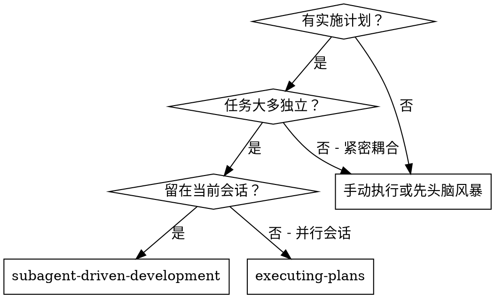
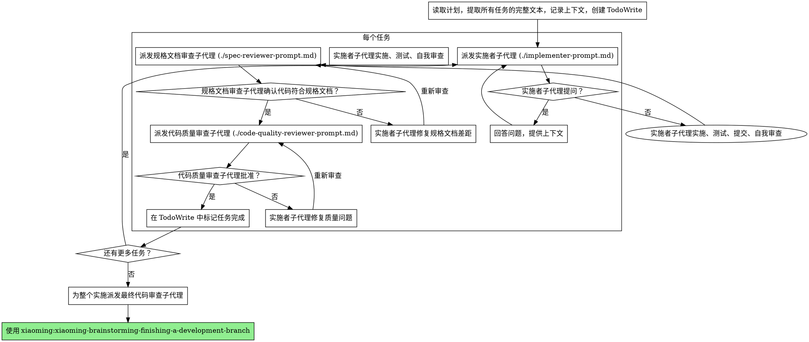

# 子代理驱动开发 (Subagent-Driven Development)

通过每个任务派发一个全新子代理 (subagent) 来执行计划，每个任务结束后进行两阶段审查：先进行规格文档 (spec) 符合性审查，再进行代码质量审查。

**为什么使用子代理：** 你将任务委托给拥有独立上下文的专用代理 (agent)。通过精确设计它们的指令和上下文，你确保它们保持专注并在任务中取得成功。它们永远不应继承你会话的上下文或历史——你构建好它们所需的一切。这同时也保留了你自己的上下文，用于协调工作。

**核心原则：** 每任务一个全新子代理 + 两阶段审查（先规格文档 (spec)，后代码质量）= 高质量、快速迭代

**持续执行：** 在任务之间不要暂停与你的真人伙伴确认。无停顿地执行计划中的所有任务。停止的唯一理由是：无法解决的 BLOCKED 状态、真正阻碍进展的歧义，或所有任务已完成。"我应该继续吗？"的提示和进度摘要浪费他们的时间——他们让你执行计划，那就执行它。

## 使用时机



**对比 Executing Plans（并行会话）：**
- 同一会话（无上下文切换）
- 每任务一个全新子代理（无上下文污染）
- 每任务后两阶段审查：先规格文档 (spec) 符合性，后代码质量
- 更快的迭代（任务之间无需人工介入）

## 流程



## 模型选择

使用能胜任每个角色的最低性能模型，以节省成本并提高速度。

**机械性实施任务**（隔离函数、规格清晰、1-2 个文件）：使用快速、廉价的模型。当计划规格完善时，大多数实施任务都是机械性的。

**集成和判断任务**（多文件协调、模式匹配、调试）：使用标准模型。

**架构、设计和审查任务**：使用最强大的可用模型。

**任务复杂度信号：**
- 涉及 1-2 个文件且规格完整 → 廉价模型
- 涉及多个文件且有集成关注点 → 标准模型
- 需要设计判断或广泛的代码库理解 → 最强大的模型

## 处理实施者状态

实施者子代理报告四种状态之一。适当处理每种情况：

**DONE（完成）：** 进行规格文档 (spec) 符合性审查。

**DONE_WITH_CONCERNS（完成但有顾虑）：** 实施者完成了工作但标记了疑虑。在继续之前阅读这些顾虑。如果顾虑是关于正确性或范围，在审查之前处理它们。如果它们是观察性的（例如，"这个文件越来越大了"），记录下来并继续审查。

**NEEDS_CONTEXT（需要上下文）：** 实施者需要未提供的信息。提供缺失的上下文并重新派发。

**BLOCKED（阻塞）：** 实施者无法完成任务。评估阻碍：
1. 如果是上下文问题，提供更多上下文并用相同模型重新派发
2. 如果任务需要更多推理，用更强大的模型重新派发
3. 如果任务太大，将其拆分为更小的部分
4. 如果计划本身有误，上报给真人

**永远不要**忽略上报或在不做任何改变的情况下强迫相同模型重试。如果实施者说它卡住了，就需要改变什么。

## 提示模板

- `./implementer-prompt.md` — 派发实施者子代理
- `./spec-reviewer-prompt.md` — 派发规格文档 (spec) 符合性审查子代理
- `./code-quality-reviewer-prompt.md` — 派发代码质量审查子代理

## 示例工作流

```
你：我正在使用子代理驱动开发来执行这个计划。

[一次性读取计划文件：docs/xiaoming/plans/feature-plan.md]
[提取所有 5 个任务的完整文字和上下文]
[用所有任务创建 TodoWrite]

任务 1：Hook 安装脚本

[获取任务 1 的文字和上下文（已提取）]
[用完整任务文字 + 上下文派发实施子代理]

实施者："在开始之前——hook 应该安装在用户级别还是系统级别？"

你："用户级别（~/.config/xiaoming/hooks/）"

实施者："明白了。正在实施……"
[稍后] 实施者：
  - 实施了 install-hook 命令
  - 添加了测试，5/5 通过
  - 自我审查：发现遗漏了 --force 标志，已添加
  - 已提交

[派发规格文档符合性审查员]
规格文档审查员：✅ 符合规格文档 - 所有需求已满足，无额外内容

[获取 git SHA，派发代码质量审查员]
代码审查员：优点：测试覆盖好，代码整洁。问题：无。已批准。

[标记任务 1 完成]

任务 2：恢复模式

[获取任务 2 的文字和上下文（已提取）]
[用完整任务文字 + 上下文派发实施子代理]

实施者：[无问题，直接进行]
实施者：
  - 添加了 verify/repair 模式
  - 8/8 测试通过
  - 自我审查：一切正常
  - 已提交

[派发规格文档符合性审查员]
规格文档审查员：❌ 发现问题：
  - 缺失：进度报告（规格文档 (spec) 说"每 100 个条目报告一次"）
  - 额外：添加了 --json 标志（未被请求）

[实施者修复问题]
实施者：删除了 --json 标志，添加了进度报告

[规格文档审查员重新审查]
规格文档审查员：✅ 现在符合规格文档 (spec)

[派发代码质量审查员]
代码审查员：优点：扎实。问题（重要）：魔法数字 (100)

[实施者修复]
实施者：提取了 PROGRESS_INTERVAL 常量

[代码审查员重新审查]
代码审查员：✅ 已批准

[标记任务 2 完成]

……

[所有任务完成后]
[派发最终代码审查员]
最终审查员：所有需求已满足，可以合并

完成！
```

## 优势

**对比手动执行：**
- 子代理自然地遵循 TDD（测试驱动开发）
- 每任务全新上下文（无混淆）
- 并行安全（子代理不相互干扰）
- 子代理可以提问（工作前后均可）

**对比 Executing Plans：**
- 同一会话（无交接）
- 持续进展（无需等待）
- 审查检查点自动化

**效率提升：**
- 无文件读取开销（控制器提供完整文字）
- 控制器精确筛选所需上下文
- 子代理预先获得完整信息
- 问题在工作开始前浮现（而非之后）

**质量关卡：**
- 自我审查在交接前捕获问题
- 两阶段审查：规格文档 (spec) 符合性，然后代码质量
- 审查循环确保修复实际生效
- 规格文档 (spec) 符合性防止过度/不足构建
- 代码质量确保实施构建良好

**成本：**
- 更多子代理调用（每任务实施者 + 2 名审查员）
- 控制器需要更多准备工作（预先提取所有任务）
- 审查循环增加迭代次数
- 但能早期捕获问题（比后期调试便宜）

## 红线警告

**永远不要：**
- 未经用户明确同意就在 main/master 分支上开始实施
- 跳过审查（规格文档 (spec) 符合性或代码质量）
- 在未修复问题的情况下继续
- 并行派发多个实施子代理（会冲突）
- 让子代理读取计划文件（改为提供完整文字）
- 跳过场景设定上下文（子代理需要理解任务的位置）
- 忽略子代理问题（在让它们继续前回答）
- 在规格文档 (spec) 符合性上接受"差不多"（审查员发现问题 = 未完成）
- 跳过审查循环（审查员发现问题 = 实施者修复 = 重新审查）
- 让实施者自我审查取代实际审查（两者都需要）
- **在规格文档 (spec) 符合性 ✅ 之前开始代码质量审查**（顺序错误）
- 在任一审查有未解决问题的情况下进入下一个任务

**如果子代理提问：**
- 清晰完整地回答
- 如需要提供额外上下文
- 不要催促它们进入实施

**如果审查员发现问题：**
- 实施者（同一个子代理）修复它们
- 审查员重新审查
- 重复直到批准
- 不要跳过重新审查

**如果子代理任务失败：**
- 派发带有具体指令的修复子代理
- 不要尝试手动修复（上下文污染）

## 集成

**必需的工作流技能 (skill)：**
- **xiaoming:xiaoming-brainstorming-using-git-worktrees** — 确保隔离的工作区存在（创建或验证现有工作区）
- **xiaoming:xiaoming-brainstorming-writing-plans** — 创建本技能执行的计划
- **xiaoming:xiaoming-brainstorming-requesting-code-review** — 为审查子代理提供代码审查模板
- **xiaoming:xiaoming-brainstorming-finishing-a-development-branch** — 所有任务完成后收尾开发工作

**子代理应该使用：**
- **xiaoming:xiaoming-brainstorming-test-driven-development** — 子代理为每个任务遵循 TDD（测试驱动开发）

**替代工作流：**
- **xiaoming:xiaoming-brainstorming-executing-plans** — 用于并行会话而非同会话执行
