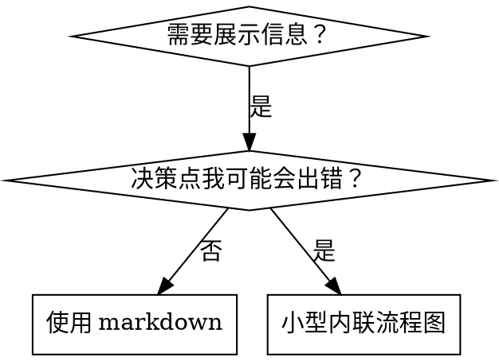

# 撰写技能 (Writing Skills)

## 概述

**撰写技能就是将 TDD（测试驱动开发）应用于流程文档。**

**个人技能存放在代理专属目录（Claude Code 使用 `~/.claude/skills`，Codex 使用 `~/.agents/skills/`）**

你写测试用例（带子代理的压力场景），看它们失败（基准行为），写技能（文档），看测试通过（代理遵守），然后重构（堵住漏洞）。

**核心原则：** 如果你没有看到代理在没有技能 (skill) 的情况下失败，你就不知道技能 (skill) 是否在教正确的东西。

**必读背景：** 在使用本技能 (skill) 之前，你必须理解 xiaoming:xiaoming-brainstorming-test-driven-development。该技能定义了基本的红-绿-重构循环。本技能将 TDD 适配到文档领域。

**官方指南：** 关于 Anthropic 官方技能 (skill) 编写最佳实践，见 anthropic-best-practices.md。该文档提供了补充本技能以 TDD 为核心方法的额外模式和指南。

## 什么是技能 (Skill)？

**技能 (skill)** 是经过验证的技术、模式或工具的参考指南。技能帮助未来的 Claude 实例找到并应用有效方法。

**技能是：** 可复用的技术、模式、工具、参考指南

**技能不是：** 关于你曾经如何解决某个问题的叙述

## TDD 映射到技能

| TDD 概念 | 技能创建 |
|-------------|----------------|
| **测试用例** | 带子代理的压力场景 |
| **生产代码** | 技能文档（SKILL.md） |
| **测试失败（红）** | 没有技能时代理违反规则（基准） |
| **测试通过（绿）** | 有技能时代理遵守 |
| **重构** | 在保持合规的同时堵住漏洞 |
| **先写测试** | 在写技能之前运行基准场景 |
| **看它失败** | 记录代理使用的确切合理化理由 |
| **最少代码** | 针对那些具体违规撰写技能 |
| **看它通过** | 验证代理现在遵守 |
| **重构循环** | 发现新的合理化 → 堵漏 → 重新验证 |

整个技能创建过程遵循红-绿-重构。

## 何时创建技能

**在以下情况创建：**
- 技术对你来说并不是显而易见的
- 你会在不同项目中再次参考这个
- 模式适用范围广（不是项目特定的）
- 其他人会受益

**不要为以下内容创建：**
- 一次性解决方案
- 在其他地方有良好文档的标准实践
- 项目特定的约定（放在 CLAUDE.md 中）
- 机械性约束（如果可以用正则/验证强制执行，就自动化——把文档留给判断性问题）

## 技能类型

### 技术 (Technique)
具体方法，有步骤可遵循（condition-based-waiting、root-cause-tracing）

### 模式 (Pattern)
思考问题的方式（flatten-with-flags、test-invariants）

### 参考 (Reference)
API 文档、语法指南、工具文档（office docs）

## 目录结构

```
skills/
  skill-name/
    SKILL.md              # 主要参考（必需）
    supporting-file.*     # 仅在需要时
```

**扁平命名空间** - 所有技能在一个可搜索的命名空间中

**单独文件用于：**
1. **大量参考**（100+ 行）- API 文档、全面语法
2. **可复用工具** - 脚本、工具、模板

**保持内联：**
- 原则和概念
- 代码模式（< 50 行）
- 其他所有内容

## SKILL.md 结构

**Frontmatter（YAML）：**
- 两个必需字段：`name` 和 `description`（所有支持字段见 [agentskills.io/specification](https://agentskills.io/specification)）
- 最多 1024 个字符
- `name`：只使用字母、数字和连字符（无括号、特殊字符）
- `description`：第三人称，只描述何时使用（不描述它做什么）
  - 以"在……时使用"开头，专注于触发条件
  - 包含具体症状、情况和上下文
  - **永远不要总结技能的流程或工作流**（见下方 CSO 章节了解原因）
  - 尽可能保持在 500 个字符以内

```markdown
---
name: Skill-Name-With-Hyphens
description: 在 [特定触发条件和症状] 时使用
---

# 技能名称

## 概述
这是什么？1-2 句话阐述核心原则。

## 使用时机
[如果决策不明显，添加小型内联流程图]

带有症状和用例的项目列表
何时不使用

## 核心模式（技术/模式类型）
前后代码对比

## 快速参考
用于扫描常见操作的表格或项目符号

## 实现
简单模式的内联代码
重量级参考或可复用工具链接到文件

## 常见错误
出了什么问题 + 修复

## 真实影响（可选）
具体结果
```

## Claude 搜索优化（CSO）

**对于发现至关重要：** 未来的 Claude 需要能够找到你的技能

### 1. 丰富的 Description 字段

**目的：** Claude 读取 description 来决定为给定任务加载哪些技能。使其回答："我现在应该读这个技能吗？"

**格式：** 以"在……时使用"开头，专注于触发条件

**关键：Description = 何时使用，而非技能做什么**

description 应该只描述触发条件。不要在 description 中总结技能的流程或工作流。

**为什么重要：** 测试发现，当 description 总结了技能的工作流时，Claude 可能会遵循 description 而不是读取完整技能内容。一个写着"任务之间进行代码审查"的 description 导致 Claude 只做了一次审查，即使技能的流程图清楚地显示了两次审查（规格文档符合性审查然后代码质量审查）。

当 description 改为仅仅"在当前会话中执行包含独立任务的实施计划时使用"（无工作流总结）时，Claude 正确地读取了流程图并遵循了两阶段审查流程。

**陷阱：** 总结工作流的 description 为 Claude 创造了捷径。技能主体变成 Claude 跳过的文档。

```yaml
# ❌ 差：总结工作流——Claude 可能会遵循这个而不是读取技能
description: 在执行计划时使用 - 每任务派发子代理，任务之间代码审查

# ❌ 差：流程细节过多
description: 用于 TDD - 先写测试，看它失败，写最少代码，重构

# ✅ 好：只有触发条件，无工作流总结
description: 在当前会话中执行包含独立任务的实施计划时使用

# ✅ 好：只有触发条件
description: 在实现任何特性或修复 Bug 时，且在编写任何业务代码前使用
```

**内容：**
- 使用具体的触发器、症状和情况，表明该技能适用
- 描述*问题*（竞态条件、行为不一致），而非*语言特定症状*（setTimeout、sleep）
- 保持触发器与技术无关，除非技能本身是技术特定的
- 如果技能是技术特定的，在触发器中明确说明
- 用第三人称写（注入系统提示中）
- **永远不要总结技能的流程或工作流**

```yaml
# ❌ 差：太抽象，模糊，不包含何时使用
description: 用于异步测试

# ❌ 差：第一人称
description: 当测试不稳定时我可以帮助你处理异步测试

# ❌ 差：提到技术但技能并非技术特定的
description: 当测试使用 setTimeout/sleep 且不稳定时使用

# ✅ 好：以"在……时使用"开头，描述问题，无工作流
description: 当测试有竞态条件、时序依赖或通过/失败不一致时使用

# ✅ 好：技术特定技能，明确触发器
description: 在使用 React Router 并处理认证重定向时使用
```

### 2. 关键词覆盖

使用 Claude 会搜索的词：
- 错误信息："Hook timed out"、"ENOTEMPTY"、"race condition"
- 症状："flaky"（脆弱）、"hanging"（挂起）、"zombie"（僵尸）、"pollution"（污染）
- 同义词："timeout/hang/freeze"、"cleanup/teardown/afterEach"
- 工具：实际命令、库名、文件类型

### 3. 描述性命名

**使用主动语态，动词优先：**
- ✅ `creating-skills` 而非 `skill-creation`
- ✅ `condition-based-waiting` 而非 `async-test-helpers`

### 4. Token 效率（关键）

**问题：** getting-started 和频繁引用的技能会加载到每一次对话中。每个 token 都很重要。

**目标词数：**
- getting-started 工作流：每个 < 150 词
- 频繁加载的技能：总共 < 200 词
- 其他技能：< 500 词（仍然要简洁）

**技术：**

**将细节移到工具帮助中：**
```bash
# ❌ 差：在 SKILL.md 中记录所有标志
search-conversations 支持 --text, --both, --after DATE, --before DATE, --limit N

# ✅ 好：引用 --help
search-conversations 支持多种模式和过滤器。运行 --help 了解详情。
```

**使用交叉引用：**
```markdown
# ❌ 差：重复工作流详情
搜索时，用模板派发子代理……
[20 行重复指令]

# ✅ 好：引用其他技能
始终使用子代理（节省 50-100 倍上下文）。必须：使用 [other-skill-name] 获取工作流。
```

**压缩示例：**
```markdown
# ❌ 差：冗长示例（42 词）
你的真人伙伴："我们之前是如何在 React Router 中处理认证错误的？"
你：我将搜索过去的对话以找到 React Router 认证模式。
[用搜索查询派发子代理："React Router authentication error handling 401"]

# ✅ 好：最简示例（20 词）
伙伴："我们如何处理 React Router 中的认证错误？"
你：搜索中……
[派发子代理 → 综合]
```

**消除冗余：**
- 不要重复交叉引用技能中的内容
- 不要解释命令中显而易见的内容
- 不要包含同一模式的多个示例

**验证：**
```bash
wc -w skills/path/SKILL.md
# getting-started 工作流：目标 < 150 每个
# 其他频繁加载的：目标 < 200 总共
```

**按你做什么或核心洞见命名：**
- ✅ `condition-based-waiting` > `async-test-helpers`
- ✅ `using-skills` 而非 `skill-usage`
- ✅ `flatten-with-flags` > `data-structure-refactoring`
- ✅ `root-cause-tracing` > `debugging-techniques`

**动名词（-ing）对流程效果很好：**
- `creating-skills`、`testing-skills`、`debugging-with-logs`
- 主动，描述你正在采取的行动

### 4. 交叉引用其他技能

**在编写引用其他技能的文档时：**

只使用技能名，带明确的要求标记：
- ✅ 好：`**必须使用子技能：** 使用 xiaoming:xiaoming-brainstorming-test-driven-development`
- ✅ 好：`**必读背景：** 你必须理解 xiaoming:xiaoming-brainstorming-systematic-debugging`
- ❌ 差：`见 skills/testing/test-driven-development`（不清楚是否必需）
- ❌ 差：`@skills/testing/test-driven-development/SKILL.md`（强制加载，消耗上下文）

**为什么不用 @ 链接：** `@` 语法立即强制加载文件，在你需要之前消耗 200k+ 上下文。

## 流程图使用



**只在以下情况使用流程图：**
- 非显而易见的决策点
- 你可能过早停止的流程循环
- "何时用 A vs B"决策

**永远不要将流程图用于：**
- 参考材料 → 表格、列表
- 代码示例 → Markdown 块
- 线性指令 → 编号列表
- 没有语义含义的标签（step1、helper2）

见 @graphviz-conventions.dot 了解 graphviz 样式规则。

**为你的真人伙伴可视化：** 使用此目录中的 `render-graphs.js` 将技能的流程图渲染为 SVG：
```bash
./render-graphs.js ../some-skill           # 每个图表单独渲染
./render-graphs.js ../some-skill --combine # 所有图表合并为一个 SVG
```

## 代码示例

**一个优秀的示例胜过许多平庸的示例**

选择最相关的语言：
- 测试技术 → TypeScript/JavaScript
- 系统调试 → Shell/Python
- 数据处理 → Python

**好的示例：**
- 完整且可运行
- 注释良好，解释了为什么
- 来自真实场景
- 清楚展示模式
- 随时可以适配（不是通用模板）

**不要：**
- 用 5 种以上语言实现
- 创建填空模板
- 写牵强的示例

你擅长移植——一个优秀示例就足够了。

## 文件组织

### 自包含技能
```
defense-in-depth/
  SKILL.md    # 所有内容内联
```
适用于：所有内容适合，不需要大量参考

### 带可复用工具的技能
```
condition-based-waiting/
  SKILL.md    # 概述 + 模式
  example.ts  # 可适配的有效辅助函数
```
适用于：工具是可复用代码，而非只是叙述

### 带大量参考的技能
```
pptx/
  SKILL.md       # 概述 + 工作流
  pptxgenjs.md   # 600 行 API 参考
  ooxml.md       # 500 行 XML 结构
  scripts/       # 可执行工具
```
适用于：参考材料太大，无法内联

## 铁律（与 TDD 相同）

```
没有失败测试，就不得创建技能
```

这适用于新技能和对现有技能的编辑。

在测试之前写技能？删掉它。重新开始。
在未测试的情况下编辑技能？同样的违规。

**没有例外：**
- 不是"简单的添加"
- 不是"只是添加一个章节"
- 不是"文档更新"
- 不要把未测试的变更保留作"参考"
- 不要在运行测试时"适配"
- 删除就是删除

**必读背景：** xiaoming:xiaoming-brainstorming-test-driven-development 技能解释了为什么这很重要。相同原则适用于文档。

## 测试所有技能类型

不同的技能类型需要不同的测试方法：

### 纪律执行技能（规则/要求）

**示例：** TDD、verification-before-completion、designing-before-coding

**测试方法：**
- 学术问题：他们理解规则吗？
- 压力场景：他们在压力下遵守吗？
- 多重压力组合：时间 + 沉没成本 + 疲劳
- 识别合理化理由并添加明确的反制

**成功标准：** 代理在最大压力下遵守规则

### 技术技能（操作指南）

**示例：** condition-based-waiting、root-cause-tracing、defensive-programming

**测试方法：**
- 应用场景：他们能正确应用技术吗？
- 变体场景：他们能处理边缘情况吗？
- 信息缺失测试：指令有缺口吗？

**成功标准：** 代理成功将技术应用于新场景

### 模式技能（心智模型）

**示例：** reducing-complexity、information-hiding 概念

**测试方法：**
- 识别场景：他们能识别模式何时适用吗？
- 应用场景：他们能使用心智模型吗？
- 反例：他们知道何时不应用吗？

**成功标准：** 代理正确识别何时/如何应用模式

### 参考技能（文档/API）

**示例：** API 文档、命令参考、库指南

**测试方法：**
- 检索场景：他们能找到正确信息吗？
- 应用场景：他们能正确使用找到的信息吗？
- 差距测试：常见用例是否覆盖？

**成功标准：** 代理找到并正确应用参考信息

## 跳过测试的常见合理化借口

| 借口 | 现实 |
|--------|---------| 
| "技能显然很清晰" | 对你清晰 ≠ 对其他代理清晰。测试它。 |
| "只是参考" | 参考可能有缺口、不清晰的章节。测试检索。 |
| "测试太过度了" | 未测试的技能有问题。始终如此。15 分钟测试节省数小时。 |
| "如果问题出现了我会测试" | 问题 = 代理无法使用技能。部署前测试。 |
| "测试太繁琐" | 测试比在生产中调试糟糕技能的繁琐更少。 |
| "我有信心它很好" | 过度自信保证会出现问题。无论如何都要测试。 |
| "学术审查已经足够" | 阅读 ≠ 使用。测试应用场景。 |
| "没时间测试" | 部署未测试技能以后修复浪费更多时间。 |

**所有这些都意味着：部署前测试。没有例外。**

## 防弹技能以抵御合理化

执行纪律的技能（如 TDD）需要抵御合理化。代理很聪明，会在压力下找到漏洞。

**心理学注意：** 理解为什么说服技术有效，帮助你系统性地应用它们。见 persuasion-principles.md 了解研究基础（Cialdini, 2021; Meincke et al., 2025）关于权威、承诺、稀缺性、社会证明和统一原则。

### 明确堵住每个漏洞

不仅仅陈述规则——禁止具体的变通方法：

<Bad>
```markdown
在测试之前写了代码？删掉它。
```
</Bad>

<Good>
```markdown
在测试之前写了代码？删掉它。重新开始。

**没有例外：**
- 不要把它保留作"参考"
- 不要在写测试时"适配"它
- 不要看它
- 删除就是删除
```
</Good>

### 处理"精神 vs 字面"争论

在早期添加基础原则：

```markdown
**违反规则的字面意思，就是违反了规则的精神。**
```

这切断了整类"我在遵守精神"的合理化。

### 建立合理化表

从基准测试（见下方测试章节）中收集合理化理由。代理使用的每个借口都进入表格：

```markdown
| 借口 | 现实 |
|--------|---------| 
| "太简单了不需要测试" | 简单代码会坏。写测试只需 30 秒。 |
| "我会在之后测试" | 立即通过的测试什么都证明不了。 |
| "事后写测试实现相同目标" | 事后测试 = "这做了什么？"先写测试 = "这应该做什么？" |
```

### 创建红线警告列表

让代理在合理化时易于自我检查：

```markdown
## 红线警告 - 停止并重新开始

- 在测试之前写代码
- "我已经手动测试过了"
- "事后写测试实现相同目的"
- "是精神而非仪式"
- "这个情况不同，因为……"

**所有这些都意味着：删掉代码。从 TDD 重新开始。**
```

### 为违规症状更新 CSO

在 description 中添加：你即将违规时的症状：

```yaml
description: 在实现任何特性或修复 Bug 时，且在编写任何业务代码前使用
```

## 技能的红-绿-重构

遵循 TDD 循环：

### 红（RED）：写失败测试（基准）

在没有技能的情况下用子代理运行压力场景。记录确切行为：
- 他们做了什么选择？
- 他们使用了什么合理化理由（逐字记录）？
- 哪些压力触发了违规？

这是"看测试失败"——你必须看到代理在写技能之前自然地做什么。

### 绿（GREEN）：写最少技能

写技能来针对那些具体的合理化理由。不要为假设的情况添加额外内容。

用技能运行相同场景。代理现在应该遵守。

### 重构（REFACTOR）：堵住漏洞

代理找到了新的合理化理由？添加明确的反制。重新测试直到防弹。

**测试方法：** 见 @testing-skills-with-subagents.md 了解完整测试方法：
- 如何写压力场景
- 压力类型（时间、沉没成本、权威、疲劳）
- 系统性地堵住漏洞
- 元测试技术

## 反模式

### ❌ 叙述性示例
"在 2025-10-03 的会话中，我们发现空 projectDir 导致……"
**为什么差：** 太具体，不可复用

### ❌ 多语言稀释
example-js.js, example-py.py, example-go.go
**为什么差：** 质量平庸，维护负担

### ❌ 流程图中的代码
```dot
step1 [label="import fs"];
step2 [label="read file"];
```
**为什么差：** 无法复制粘贴，难以阅读

### ❌ 通用标签
helper1, helper2, step3, pattern4
**为什么差：** 标签应该有语义含义

## 停止：在移到下一个技能之前

**写完任何技能后，你必须停止并完成部署流程。**

**不要：**
- 批量创建多个技能而不测试每一个
- 在当前技能验证之前移到下一个
- 因为"批量处理更高效"而跳过测试

**下面的部署检查清单对于每个技能都是强制性的。**

部署未测试的技能 = 部署未测试的代码。这是违反质量标准的。

## 技能创建检查清单（TDD 适配）

**重要：使用 TodoWrite 为以下每个检查清单项目创建待办事项。**

**红（RED）阶段 - 写失败测试：**
- [ ] 创建压力场景（纪律技能需要 3 个以上组合压力）
- [ ] 在没有技能的情况下运行场景——逐字记录基准行为
- [ ] 识别合理化/失败的模式

**绿（GREEN）阶段 - 写最少技能：**
- [ ] 名称只使用字母、数字、连字符（无括号/特殊字符）
- [ ] YAML frontmatter 包含必需的 `name` 和 `description` 字段（最多 1024 字符；见 [规范](https://agentskills.io/specification)）
- [ ] Description 以"在……时使用"开头，包含具体触发器/症状
- [ ] Description 用第三人称写
- [ ] 整个文档有关键词用于搜索（错误、症状、工具）
- [ ] 清晰的概述，包含核心原则
- [ ] 针对在红阶段识别的具体基准失败
- [ ] 代码内联或链接到单独文件
- [ ] 一个优秀示例（不是多语言）
- [ ] 用技能运行场景——验证代理现在遵守

**重构（REFACTOR）阶段 - 堵住漏洞：**
- [ ] 从测试中识别新的合理化理由
- [ ] 添加明确的反制（如果是纪律技能）
- [ ] 从所有测试迭代中建立合理化表
- [ ] 创建红线警告列表
- [ ] 重新测试直到防弹

**质量检查：**
- [ ] 只有当决策非显而易见时才使用小型流程图
- [ ] 快速参考表格
- [ ] 常见错误章节
- [ ] 无叙述性故事
- [ ] 支持文件只用于工具或大量参考

**部署：**
- [ ] 保存技能文档并同步到远程仓库（如果已配置）
- [ ] 考虑通过 PR 贡献回去（如果普遍有用）

## 发现工作流

未来的 Claude 如何找到你的技能：

1. **遇到问题**（"测试不稳定"）
3. **找到技能**（description 匹配）
4. **扫描概述**（这相关吗？）
5. **阅读模式**（快速参考表格）
6. **加载示例**（只在实现时）

**针对这个流程优化** - 尽早且频繁地放置可搜索的术语。

## 总结

**创建技能就是将 TDD 应用于流程文档。**

相同的铁律：没有失败测试，就不得创建技能。
相同的循环：红（基准）→ 绿（写技能）→ 重构（堵住漏洞）。
相同的优势：更高质量、更少惊喜、防弹结果。

如果你对代码遵循 TDD，就对技能遵循 TDD。这是应用于文档的同一纪律。
