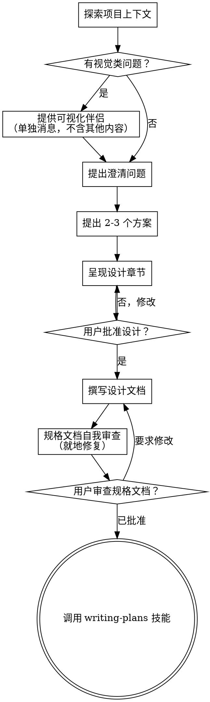

# 将想法转化为设计

通过自然的协作对话，帮助将想法转化为完整的设计与规格文档 (spec)。

先理解当前项目上下文，然后逐一提问以细化想法。一旦明确了要构建的内容，呈现设计方案并获得用户批准。

<HARD-GATE>
在向用户呈现设计方案并获得批准之前，绝对不得调用任何实施类技能 (skill)、编写任何代码、创建任何脚手架 (scaffold) 或采取任何实施行动。无论项目看起来多么简单，此规则适用于每一个项目。
</HARD-GATE>

## 反模式 (Anti-Pattern)："这太简单了，不需要设计"

每个项目都要经历这个流程。待办事项列表、单函数工具、配置变更——无一例外。"简单"项目恰恰是未经审视的假设造成最多无效工作的地方。设计可以很短（对真正简单的项目来说几句话即可），但你必须呈现设计并获得批准。

## 检查清单 (Checklist)

你**必须**为以下每一项创建任务，并按顺序完成：

1. **探索项目上下文** — 检查文件、文档、近期提交 (commit)
2. **提供可视化伴侣 (Visual Companion)**（如果话题将涉及视觉类问题）— 这是独立的一条消息，不与澄清问题合并。详见下方"可视化伴侣"章节。
3. **提出澄清问题** — 逐一提问，理解目的/约束/成功标准
4. **提出 2-3 个方案** — 附权衡 (trade-off) 分析及你的推荐理由
5. **呈现设计** — 按各章节的复杂度分段呈现，每段后获取用户批准
6. **撰写设计文档** — 保存至 `docs/xiaoming/specs/YYYY-MM-DD-<topic>-design.md` 并提交 (commit)
7. **规格文档自我审查 (Spec self-review)** — 快速就地检查占位符、矛盾、歧义、范围（见下文）
8. **用户审查规格文档** — 请用户审查规格文档文件后再继续
9. **过渡到实施** — 调用 writing-plans 技能 (skill) 创建实施计划 (implementation plan)

## 流程图

**终态是调用 writing-plans。** 绝对不得调用 frontend-design、mcp-builder 或任何其他实施类技能 (skill)。头脑风暴 (brainstorming) 结束后唯一要调用的技能就是 writing-plans。

## 流程详解

**理解想法：**

- 首先了解当前项目状态（文件、文档、近期提交 (commit)）
- 在深入提问之前，先评估范围：如果请求描述了多个独立子系统（例如"构建一个包含聊天、文件存储、计费和分析的平台"），立即指出这一点。不要在分解之前就急着细化某个子系统的细节。
- 如果项目太大，无法纳入单一规格文档 (spec)，帮助用户分解为子项目：有哪些独立部分，它们之间如何关联，应按什么顺序构建？然后按正常设计流程对第一个子项目进行头脑风暴 (brainstorming)。每个子项目有各自的规格文档 → 计划 → 实施循环。
- 对范围适当的项目，逐一提问以细化想法
- 尽量使用多选题，但开放式问题也可以
- 每条消息只问一个问题——如果某个话题需要更多探讨，拆分成多个问题
- 聚焦于理解：目的、约束、成功标准

**探索方案：**

- 提出 2-3 个不同方案，附权衡 (trade-off) 分析
- 以对话方式呈现选项，说明你的推荐及理由
- 首先提出你推荐的选项并解释原因

**呈现设计：**

- 一旦你认为理解了要构建的内容，就呈现设计
- 根据每个章节的复杂度调整篇幅：简单内容用几句话，复杂内容最多 200-300 字
- 每个章节结束后询问是否正确
- 涵盖：架构、组件、数据流、错误处理、测试
- 如有不清楚的地方，随时准备回头澄清

**为隔离性和清晰性而设计：**

- 将系统拆分为更小的单元，每个单元有一个明确目的，通过定义良好的接口通信，可以独立理解和测试
- 对每个单元，你应该能回答：它做什么、怎么使用它、依赖什么？
- 不看内部实现，别人能理解这个单元做什么吗？能在不破坏调用方的情况下修改内部实现吗？如果不能，边界需要重新划分。
- 更小、边界清晰的单元对你来说也更易于处理——你对一次能放入上下文中的代码推理更准确，文件聚焦时编辑也更可靠。当文件变大，往往意味着它承担了太多职责。

**在现有代码库中工作：**

- 提出改动之前先探索当前结构，遵循现有模式。
- 现有代码中影响当前工作的问题（例如文件过大、边界不清、职责混乱），将针对性改进作为设计的一部分纳入——就像一个优秀开发者改进他正在修改的代码那样。
- 不要提议无关的重构。聚焦于服务当前目标的内容。

## 设计完成后

**文档：**

- 将经过验证的设计（规格文档 spec）写入 `docs/xiaoming/specs/YYYY-MM-DD-<topic>-design.md`
  - （用户对规格文档位置的偏好优先于此默认设置）
- 如果有 elements-of-style:writing-clearly-and-concisely 技能 (skill)，可使用
- 将设计文档提交 (commit) 到 git

**规格文档自我审查 (Spec Self-Review)：**
撰写完规格文档后，用全新的眼光审视它：

1. **占位符扫描：** 有没有 "TBD"、"TODO"、未完成章节或模糊需求？修复它们。
2. **内部一致性：** 各章节之间有没有矛盾？架构与功能描述是否匹配？
3. **范围检查：** 这是否聚焦到足以支撑单一实施计划 (implementation plan)，还是需要分解？
4. **歧义检查：** 有没有需求可以被两种方式解读？如果有，选择其中一种并明确说明。

就地修复问题。无需重新审查——修复后继续推进即可。

**用户审查关卡：**
规格文档审查循环通过后，请用户在继续之前审查规格文档：

> "规格文档已撰写并提交 (commit) 至 `<路径>`。请审查后告知是否需要修改，然后我们开始撰写实施计划 (implementation plan)。"

等待用户回应。如果他们要求修改，进行修改后重新运行规格文档审查循环。只有在用户批准后才继续推进。

**实施：**

- 调用 writing-plans 技能 (skill) 创建详细的实施计划 (implementation plan)
- 绝对不得调用其他任何技能 (skill)。writing-plans 是下一步。

## 核心原则

- **每次只问一个问题** — 不要用多个问题淹没用户
- **优先使用多选题** — 比开放式问题更易回答
- **无情地执行 YAGNI（你不会需要它）** — 从所有设计中剔除不必要的功能
- **探索备选方案** — 在确定方案之前，始终提出 2-3 个方案
- **渐进式验证** — 呈现设计，获得批准后再推进
- **保持灵活** — 如有不清楚的地方，随时回头澄清

## 可视化伴侣 (Visual Companion)

基于浏览器的伴侣工具，用于在头脑风暴 (brainstorming) 过程中展示原型图、图表和视觉选项。作为工具使用——而非一种模式。接受该伴侣意味着它可用于需要视觉呈现的问题；这**不**意味着每个问题都要通过浏览器处理。

**提供伴侣：** 当你预判接下来的问题将涉及视觉内容（原型图、布局、图表）时，征询一次同意：
> "我们正在进行的部分内容，如果能在浏览器中展示给你看可能会更容易理解。在讨论过程中，我可以制作原型图、图表、对比图等可视化内容。这个功能还比较新，可能会消耗较多 token。要试试吗？（需要打开本地 URL）"

**此提议必须作为独立消息发送。** 不得与澄清问题、上下文总结或任何其他内容合并。该消息应仅包含上述提议，不含其他任何内容。等待用户回应后再继续。如果用户拒绝，则继续纯文字方式的头脑风暴 (brainstorming)。

**逐问决策：** 即使用户接受了伴侣，也要**对每个问题**单独决定是使用浏览器还是终端。判断标准：**用户看到比阅读更容易理解吗？**

- **使用浏览器**处理确实具有视觉性的内容——原型图、线框图、布局对比、架构图、并排视觉设计
- **使用终端**处理文字性内容——需求问题、概念选择、权衡 (trade-off) 列表、A/B/C/D 文字选项、范围决策

关于 UI 话题的问题并不自动成为视觉问题。"这个上下文里'个性'是什么意思？"是概念性问题——用终端。"哪种向导布局更好？"是视觉问题——用浏览器。

如果用户同意使用伴侣，在继续之前请阅读详细指南：
`skills/xiaoming/visual-companion.md`
